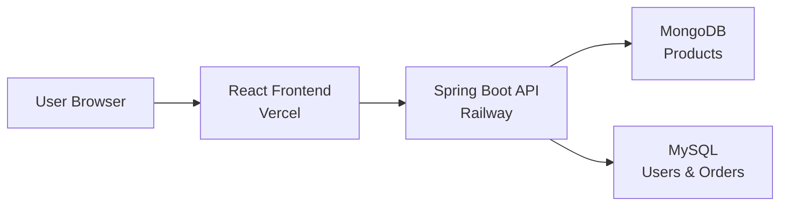
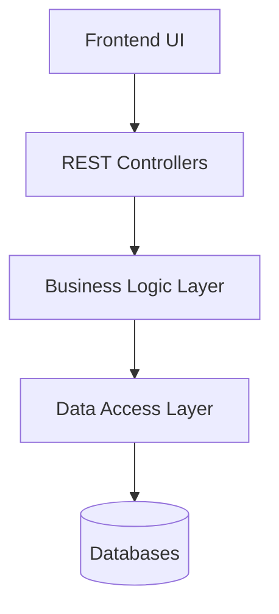
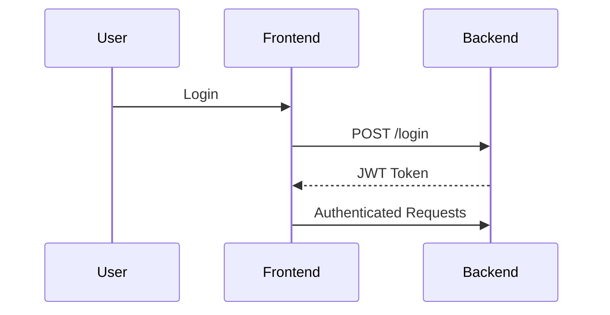
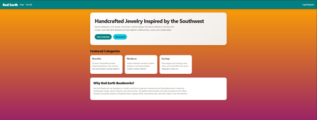
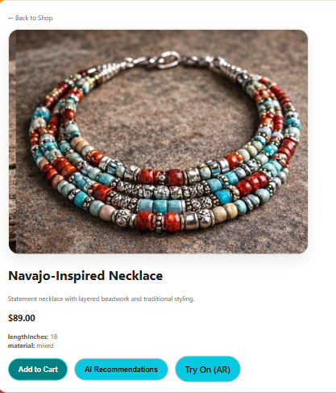
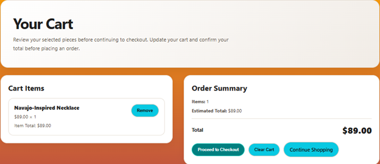
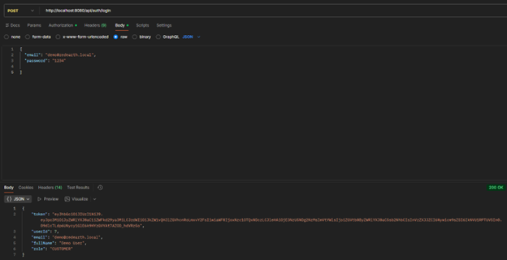
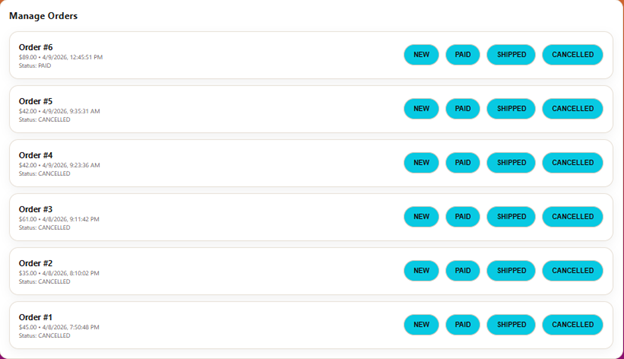
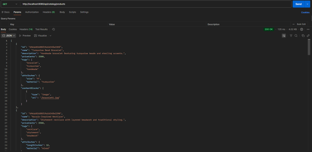
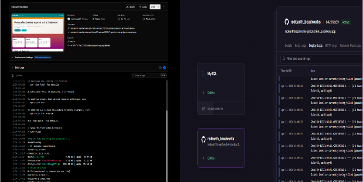

# 🌵 Red Earth Bead Works
### Full-Stack E-Commerce Platform | Capstone Project

---

## 🔗 Live Application

- **Frontend (Vercel):** https://redearth-beadworks.vercel.app  
- **Backend (Railway):** https://redearthbeadworks-production.up.railway.app  

---

## 📌 Overview

Red Earth Bead Works is a fully deployed, production-ready full-stack web application supporting a handcrafted jewelry business.

The system includes authentication, product browsing, shopping cart functionality, and order processing using a cloud-based architecture.

---

## 🧱 System Architecture

---

## 🏗️ Architecture Pattern

---

## 🔐 Authentication Flow

---

## 🧰 Tech Stack

Frontend:
- React
- TypeScript
- Vite

Backend:
- Java 17
- Spring Boot
- Spring Security (JWT)

Databases:
- MongoDB
- MySQL

Deployment:
- Vercel
- Railway

---

## ⚙️ Features

- JWT Authentication
- Product Catalog
- Shopping Cart
- Order Processing
- Cloud Deployment

---

## 📦 API Endpoints

Auth:
POST /api/auth/login  
POST /api/auth/register  

Products:
GET /api/catalog/products  

Orders:
POST /api/orders  
GET /api/orders/mine  

Checkout:
POST /api/checkout/intent  
POST /api/checkout/confirm  

---

## 🧪 Testing

| Test | Result |
|------|-------|
| Login | Pass |
| Order Creation | Pass |
| Fetch Orders | Pass |

---

## 📊 Traceability Matrix

| Requirement | Code |
|------------|------|
| Login | AuthService |
| Orders | OrdersService |

---

## ⚠️ Challenges

- CORS issues → fixed with SecurityConfig
- Deployment errors → resolved in Railway
- JWT setup → secured endpoints

---

## 🔮 Future Improvements

- Stripe integration
- Admin dashboard
- Notifications

---

 ## 📸 Screenshots & System Demonstration

### 🏠 Home Page – Product Catalog

**Description:**  
Displays the product catalog retrieved from the backend API. Users can browse handcrafted jewelry items with pricing and descriptions. This demonstrates successful frontend-to-backend communication and MongoDB product retrieval.

---

### 🔍 Product Detail Page

**Description:**  
Shows detailed product information including images, pricing, and attributes. Users can select items and add them to the shopping cart. This validates dynamic routing and data binding.

---

### 🛒 Shopping Cart

**Description:**  
Displays selected products with quantities and total pricing. Users can remove items or proceed to checkout. This demonstrates frontend state management and cart persistence.

---

### 🔐 Login / Authentication

**Description:**  
Allows users to securely authenticate using email and password. JWT tokens are generated upon successful login and stored for authenticated API requests.

---

### 📦 Orders Page (Account)

**Description:**  
Displays user-specific order history retrieved from the backend. This confirms secure API access and proper linkage between users and orders in MySQL.

---

### 📡 API Testing (Postman)

**Description:**  
Demonstrates successful API responses for authentication, product retrieval, and order endpoints. Confirms backend functionality and RESTful design.

---

### ☁️ Deployment (Railway + Vercel)

**Description:**  
Shows the live deployment of the backend on Railway and frontend on Vercel. Confirms successful cloud hosting and system accessibility. -->

## 👨‍💻 Authors

Noah Rose  
Doreen Rose  

---

## GitHub

https://github.com/noahrose82/redearth_beadworks
