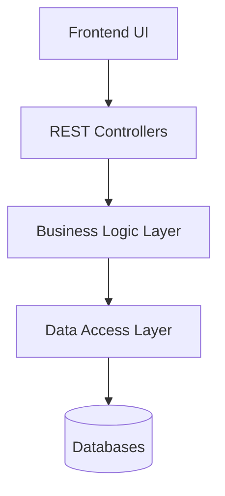
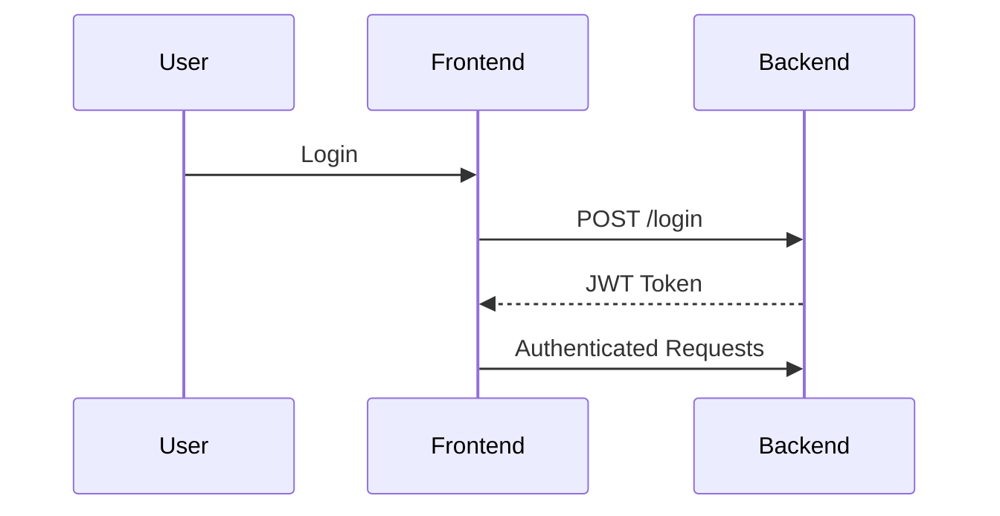

# 🌵 Red Earth Bead Works
### Full-Stack E-Commerce Platform | Capstone Project

---

## 🔗 Live Application

- **Frontend (Vercel):** https://redearth-beadworks.vercel.app  
- **Backend (Railway):** https://redearthbeadworks-production.up.railway.app  

---

## 📌 Overview

Red Earth Bead Works is a fully deployed, production-ready full-stack web application supporting a handcrafted jewelry business.

The system includes authentication, product browsing, shopping cart functionality, and order processing using a cloud-based architecture.

---

## 🧱 System Architecture

```mermaid
flowchart LR
    A[User Browser] --> B[React Frontend (Vercel)]
    B --> C[Spring Boot API (Railway)]
    C --> D[MongoDB (Products)]
    C --> E[MySQL (Users & Orders)]
```

---

## 🏗️ Architecture Pattern



---

## 🔐 Authentication Flow



---

## 🧰 Tech Stack

Frontend:
- React
- TypeScript
- Vite

Backend:
- Java 17
- Spring Boot
- Spring Security (JWT)

Databases:
- MongoDB
- MySQL

Deployment:
- Vercel
- Railway

---

## ⚙️ Features

- JWT Authentication
- Product Catalog
- Shopping Cart
- Order Processing
- Cloud Deployment

---

## 📦 API Endpoints

Auth:
POST /api/auth/login  
POST /api/auth/register  

Products:
GET /api/catalog/products  

Orders:
POST /api/orders  
GET /api/orders/mine  

Checkout:
POST /api/checkout/intent  
POST /api/checkout/confirm  

---

## 🧪 Testing

| Test | Result |
|------|-------|
| Login | Pass |
| Order Creation | Pass |
| Fetch Orders | Pass |

---

## 📊 Traceability Matrix

| Requirement | Code |
|------------|------|
| Login | AuthService |
| Orders | OrdersService |

---

## ⚠️ Challenges

- CORS issues → fixed with SecurityConfig
- Deployment errors → resolved in Railway
- JWT setup → secured endpoints

---

## 🔮 Future Improvements

- Stripe integration
- Admin dashboard
- Notifications

---

## 👨‍💻 Authors

Noah Rose  
Doreen Rose  

